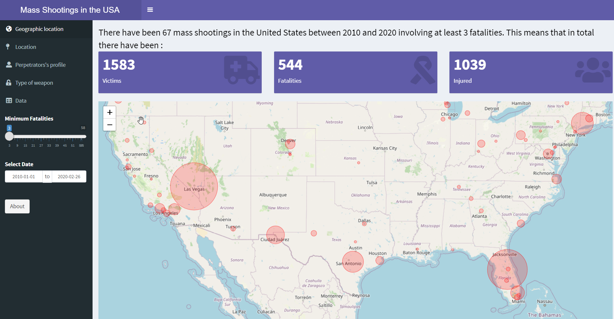
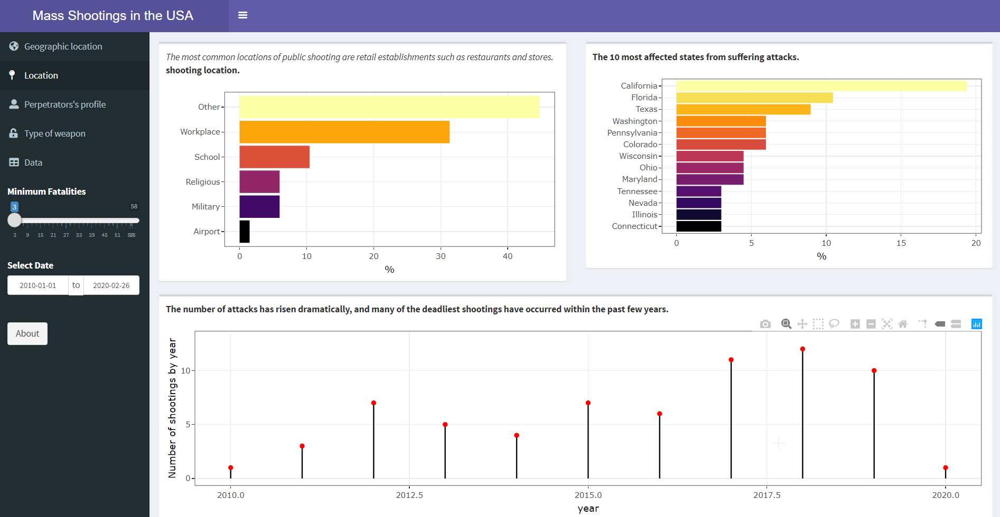
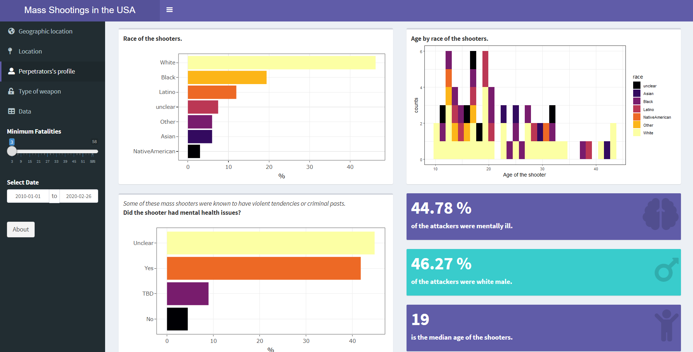

# Mass Shootings in the USA shiny dashboard 

This dashboard provides descriptive analysis about mass shooting in the United States since 1982. 
It's possible to obtenin summary statistics filtering the data by date and number of fatalities 
involved in the attack. It's organised in five tab that are described above.

- The interactive dashboard has been build using [htmlwidgets for R](http://www.htmlwidgets.org/). 
- The data comes from the [Mother Jones’ Investigation](https://www.motherjones.com/politics/2012/12/mass-shootings-mother-jones-full-data/)
about mass shootings in the USA. 

## Tab 1 : geographic location 

The map has been build using the [`leaet` package](http://rstudio.github.io/leaflet/).

## Tab 2 : location 

The interactivity of the graphs has been added by using the [`plotly` package](https://plot.ly/r/). 

### Tab 3 : shooter's profile 

Some demographics variables, such as age and race are explored here. 

### Tab 4 : type of weapon 

### Tab 5 : data 

It's possible to visualize and download the data used in these analysis.
The interactivity of the table has been added using [`DT` package](http://rstudio.github.io/DT/) 

Visit [shiny io](https://danaemirelmartinez.shinyapps.io/usa_shootings_dashboard/) to see the action!

